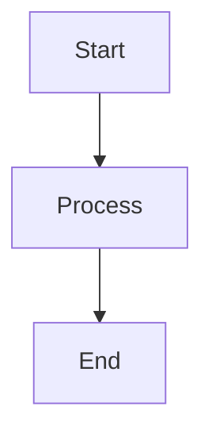

# Stoodio MD Viewer - Feature Specification

Based on Typora menu analysis and website (typora.io). This document catalogs all features for the markdown viewer clone.

---

## Design Philosophy

### "What You See Is What You Mean" (WYSIWYM)

Typora's core innovation is **live preview without a split view**:
- No separate preview pane or mode switcher
- Markdown syntax renders immediately as you type
- Click rendered content to edit the underlying markdown
- Distraction-free, minimal interface

### Key UX Principles
1. **Seamless editing** - Format text naturally, markdown is hidden until focused
2. **Minimal chrome** - No toolbar clutter, rely on shortcuts and menus
3. **Focus on content** - Remove distractions, center the writing experience

---

## Menu Structure Overview

| Menu | Purpose |
|------|---------|
| App Menu | About, Settings, License, Updates |
| File | Document management, import/export |
| Edit | Text manipulation, find/replace, tools |
| Paragraph | Block-level formatting (headings, lists, code) |
| Format | Inline formatting (bold, italic, links) |
| View | UI modes, sidebar, zoom |
| Themes | Visual themes |
| Window | Window management |
| Help | Documentation, support |

---

## 1. App Menu (Stoodio MD Viewer)

| Item | Shortcut | Priority |
|------|----------|----------|
| About | - | P1 |
| Settings... | ⌘, | P1 |
| Check for Updates | - | P2 |
| Services | > | P3 (system) |
| Hide App | ⌘H | P1 (system) |
| Hide Others | ⌥⌘H | P1 (system) |
| Show All | - | P1 (system) |
| Quit | ⌘Q | P1 (system) |

---

## 2. File Menu

| Item | Shortcut | Priority | Notes |
|------|----------|----------|-------|
| New | ⌘N | P1 | |
| New Tab | ⌘T | P2 | |
| New Window | ⌥⌘N | P2 | |
| Open... | ⌘O | P1 | |
| Open Recent | > | P1 | Submenu |
| Open Quickly... | ⌥⌘O | P2 | Quick file picker |
| Get Info... | - | P3 | File metadata |
| Reveal in Library | - | P3 | |
| Reveal in File Tree | - | P2 | |
| Open File Location | - | P2 | Show in Finder |
| Delete... | - | P2 | |
| Close | ⌘W | P1 | |
| Save | ⌘S | P1 | |
| Duplicate | ⇧⌘S | P2 | |
| Rename... | - | P2 | |
| Move To... | - | P2 | |
| Revert To | > | P3 | Version history |
| Save All... | ⌥⇧⌘S | P2 | |
| Share | > | P2 | System share sheet |
| Import... | - | P2 | |
| Export | > | P1 | PDF, HTML, etc. |
| Page Setup... | ⌥⌘P | P3 | |
| Print... | ⌘P | P2 | |

---

## 3. Edit Menu

| Item | Shortcut | Priority | Notes |
|------|----------|----------|-------|
| Undo | ⌘Z | P1 | |
| Redo | ⇧⌘Z | P1 | |
| Cut | ⌘X | P1 | |
| Copy | ⌘C | P1 | |
| Copy Image Content | - | P3 | |
| Paste | ⌘V | P1 | |
| Copy as Plain Text | - | P2 | |
| Copy as Markdown | ⇧⌘C | P1 | |
| Copy as HTML Code | - | P2 | |
| Copy without Theme Styling | - | P3 | |
| Paste as Plain Text | ⌥⇧⌘V | P2 | |
| Selection | > | P2 | Select all, line, etc. |
| Move Row Up | ⌃⌘↑ | P2 | |
| Move Row Down | ⌃⌘↓ | P2 | |
| Delete | - | P1 | |
| Delete Range | > | P2 | |
| Math Tools | > | P3 | |
| Line Endings | > | P2 | LF/CRLF |
| Whitespace and Line Breaks | > | P2 | |
| Substitutions | > | P3 | Smart quotes, etc. |
| Writing Tools | - | P3 | macOS AI tools |
| Spelling and Grammar | - | P2 | |
| Find | > | P1 | Find/Replace |
| Speech | > | P3 | |
| AutoFill | > | P3 | |
| Start Dictation... | - | P3 | |
| Emoji & Symbols | - | P2 | |

---

## 4. Paragraph Menu

| Item | Shortcut | Priority | Notes |
|------|----------|----------|-------|
| Heading 1 | ⌘1 | P1 | |
| Heading 2 | ⌘2 | P1 | |
| Heading 3 | ⌘3 | P1 | |
| Heading 4 | ⌘4 | P1 | |
| Heading 5 | ⌘5 | P1 | |
| Heading 6 | ⌘6 | P1 | |
| Paragraph | ⌘0 | P1 | Normal text |
| Increase Heading Level | ⌘+ | P2 | |
| Decrease Heading Level | ⌘- | P2 | |
| Table | > | P1 | Insert/edit tables |
| Math Block | ⌃⇧⌘B | P2 | LaTeX blocks |
| Code Fences | ⌃⇧⌘C | P1 | ``` blocks |
| Code Tools | > | P2 | |
| Alert | > | P2 | Callout boxes |
| Quote | ⌃⇧⌘Q | P1 | Blockquotes |
| Ordered List | ⌃⇧⌘O | P1 | |
| Unordered List | ⌃⇧⌘U | P1 | |
| Task List | ⌃⇧⌘X | P1 | Checkboxes |
| Task Status | > | P3 | Toggle complete |
| List Indentation | > | P2 | Indent/outdent |
| Insert Paragraph Before | - | P2 | |
| Insert Paragraph After | - | P2 | |
| Link Reference | ⌃⇧⌘L | P2 | |
| Footnotes | ⌃⇧⌘R | P2 | |
| Horizontal Line | ⌃⇧⌘- | P1 | --- |
| Table of Contents | - | P2 | Auto-generate TOC |
| YAML Front Matter | - | P2 | Metadata block |

---

## 5. Format Menu

| Item | Shortcut | Priority | Notes |
|------|----------|----------|-------|
| Strong | ⌘B | P1 | **bold** |
| Emphasis | ⌘I | P1 | *italic* |
| Underline | ⌘U | P2 | |
| Code | - | P1 | `inline code` |
| Inline Math | ⌃M | P2 | $latex$ |
| Strike | ⌃⇧` | P1 | ~~strikethrough~~ |
| Comment | - | P2 | HTML comments |
| Hyperlink | ⌘K | P1 | [text](url) |
| Hyperlink Actions | > | P2 | Edit, open, copy |
| Image | > | P1 | Insert images |
| Insert from iPhone | > | P3 | Continuity Camera |
| Clear Format | ⌘\ | P1 | Remove formatting |

---

## 6. View Menu

| Item | Shortcut | Priority | Notes |
|------|----------|----------|-------|
| Show Tab Bar | - | P2 | |
| Show All Tabs | ⇧⌘\ | P2 | |
| Source Code Mode | ⌘/ | P1 | Raw markdown toggle |
| Focus Mode | F8 | P2 | Highlight current block |
| Typewriter Mode | F9 | P2 | Keep cursor centered |
| Toggle Sidebar | ⌥⌘L | P1 | |
| Outline | ⌃⌘1 | P1 | Document outline |
| Articles | ⌃⌘2 | P2 | File list |
| File Tree | ⌃⌘3 | P1 | Folder navigation |
| Search | ⌥⌘F | P1 | Global search |
| Toggle Word Count Popover | - | P2 | |
| Toggle Outline Popover | - | P2 | |
| Allow Magnification | - | P3 | |
| Actual Size | ⌘0 | P1 | |
| Zoom In | ⌘= | P1 | |
| Zoom Out | ⌘- | P1 | |
| Always on Top | - | P3 | |
| Full Screen | ⌃⌘F | P1 | |

---

## 7. Themes Menu

| Theme | Priority |
|-------|----------|
| Github | P1 (default) |
| Gothic | P2 |
| Newsprint | P2 |
| Night | P1 (dark mode) |
| Pixyll | P2 |
| Whitey | P2 |

**Custom Themes**: Support for user-defined CSS themes (P2)

---

## 8. Window Menu

| Item | Shortcut | Priority | Notes |
|------|----------|----------|-------|
| Minimize | ⌘M | P1 (system) | |
| Zoom | - | P1 (system) | |
| Fill | ⌃⌥F | P2 | |
| Center | ⌃⌥C | P2 | |
| Move & Resize | > | P2 | |
| Full Screen Tile | > | P2 | |
| Move to Display | - | P2 | Multi-monitor |
| Bring All to Front | - | P1 (system) | |
| Tab Navigation | - | P2 | |
| Merge All Windows | - | P2 | |
| [Open Documents] | - | P1 | Document switcher |

---

## 9. Help Menu

| Item | Priority | Notes |
|------|----------|-------|
| Search | P1 | Menu search |
| What's New... | P2 | |
| Quick Start | P1 | Onboarding |
| Markdown Reference | P1 | Syntax guide |
| Custom Themes | P2 | Theme docs |
| Credits | P3 | |
| Change Log | P2 | |
| Privacy Policy | P2 | |
| Website | P2 | |
| Feedback | P2 | |

---

## Priority Legend

- **P1**: Core functionality - Must have for MVP
- **P2**: Important features - Include in v1.0
- **P3**: Nice to have - Future versions

---

## Core Features Summary (P1 Items)

### Document Management
- New/Open/Save/Close documents
- Recent files
- Export (PDF, HTML)

### Editing
- Full markdown syntax support
- Undo/Redo
- Copy as Markdown/HTML
- Find & Replace

### Block Formatting
- Headings (H1-H6)
- Paragraphs
- Code fences
- Blockquotes
- Lists (ordered, unordered, task)
- Tables
- Horizontal rules

### Inline Formatting
- Bold, Italic, Strikethrough
- Inline code
- Hyperlinks
- Images
- Clear formatting

### View Modes
- Source Code Mode (raw markdown)
- Sidebar with File Tree & Outline
- Zoom controls
- Full screen

### Themes
- Light theme (Github-style)
- Dark theme (Night)

---

## Advanced Features (from typora.io)

### Diagram Support (P2)
- **Mermaid** - Flowcharts, sequence diagrams, Gantt charts, class diagrams
- **Flowchart.js** - Simple flowcharts
- **Sequence diagrams** - Via js-sequence-diagrams

```markdown

```

### Math & LaTeX (P2)
- **MathJax** rendering engine
- Inline math: `$E = mc^2$`
- Block math: `$$\sum_{i=1}^n x_i$$`
- Support for LaTeX commands

### Image Handling (P1)
- Drag & drop insertion
- Copy/paste from clipboard
- Relative path support
- Image resizing in editor
- Upload to image hosting (optional)

### Smart Editing Features (P2)
- **Auto-pair** - Brackets, quotes, markdown syntax
- **Smart punctuation** - Curly quotes, em-dashes (SmartyPants)
- **Auto-numbering** - Heading numbers
- **Auto-complete** - Emoji, file paths

### Focus & Typewriter Modes (P2)
- **Focus Mode** - Dims all lines except current paragraph
- **Typewriter Mode** - Keeps cursor vertically centered

### Export Formats (P1-P2)
| Format | Priority | Engine |
|--------|----------|--------|
| PDF | P1 | Native/Pandoc |
| HTML | P1 | Native |
| DOCX | P2 | Pandoc |
| LaTeX | P3 | Pandoc |
| EPUB | P3 | Pandoc |
| OpenOffice | P3 | Pandoc |
| MediaWiki | P3 | Pandoc |

---

## Technical Considerations

### Platform Options

**Option A: Swift/SwiftUI (Recommended for macOS-only)**
- Native performance and feel
- Smaller app bundle (~20-50MB)
- Full macOS integration (services, continuity)
- Harder to port cross-platform

**Option B: Electron**
- Faster development with web technologies
- Cross-platform potential (macOS, Windows, Linux)
- Larger bundle (~150MB+)
- Typora itself uses Electron

**Option C: Tauri**
- Modern Electron alternative
- Smaller bundle (~10-30MB)
- Rust backend, web frontend
- Growing ecosystem

### Markdown Rendering Stack

**Parser Options:**
- **markdown-it** - Extensible, plugin ecosystem (JS)
- **cmark-gfm** - GitHub's CommonMark implementation (C)
- **swift-markdown** - Apple's native parser (Swift)
- **Ink** - Swift markdown parser by John Sundell

**Code Highlighting:**
- highlight.js or Prism (JS)
- TreeSitter (native)

### File Formats
- Primary: .md, .markdown, .mdown, .mkd
- Import: .txt, .html, .docx (via Pandoc)
- Export: .pdf, .html, .docx, .latex, .epub

### Rendering Requirements
- CommonMark compliant
- GitHub Flavored Markdown (GFM) extensions:
  - Tables
  - Task lists
  - Strikethrough
  - Autolinks
  - Fenced code blocks
- Syntax highlighting (~100 languages)

### Storage
- File-based (no database required)
- Recent files: UserDefaults or SQLite
- Preferences: UserDefaults or JSON config
- Themes: CSS files in Application Support

---

## Next Steps

### Phase 1: Foundation
1. **Choose technology stack** - Swift/SwiftUI vs Electron vs Tauri
2. **Set up project scaffold** - Build system, dependencies, basic window
3. **Implement core editor** - Text input with markdown parsing
4. **WYSIWYM rendering** - Live preview in same view (the hard part)

### Phase 2: File Operations
5. **Open/Save files** - Basic file I/O with .md files
6. **Recent files** - Track and display recently opened documents
7. **File tree sidebar** - Navigate folders and files
8. **Document outline** - Auto-generated heading navigation

### Phase 3: Editing Features
9. **Block formatting** - Headings, lists, code blocks, tables
10. **Inline formatting** - Bold, italic, links, images
11. **Keyboard shortcuts** - All standard markdown shortcuts
12. **Find & Replace** - Search within document

### Phase 4: Polish
13. **Themes** - Light/dark themes with CSS customization
14. **Export** - PDF and HTML export
15. **Focus/Typewriter modes** - Distraction-free writing
16. **Preferences** - Settings panel

### Phase 5: Advanced (Future)
17. **Mermaid diagrams** - Flowcharts, sequence diagrams
18. **Math/LaTeX** - MathJax integration
19. **Pandoc integration** - Advanced export formats
20. **Tabs** - Multiple documents

---

## Reference

- **Typora Website**: https://typora.io
- **Typora Support**: https://support.typora.io
- **Typora Themes**: https://theme.typora.io
- **CommonMark Spec**: https://spec.commonmark.org
- **GFM Spec**: https://github.github.com/gfm/
